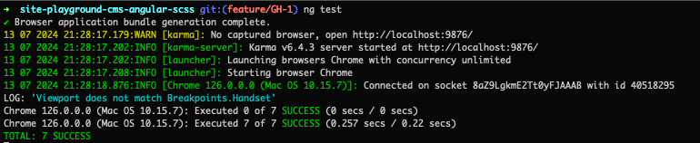
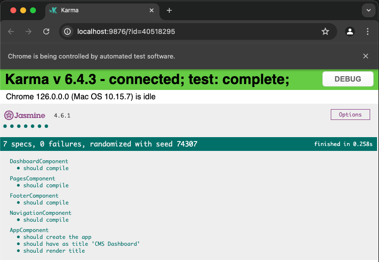
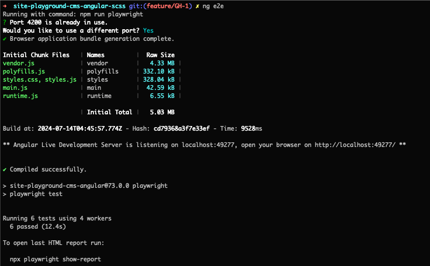
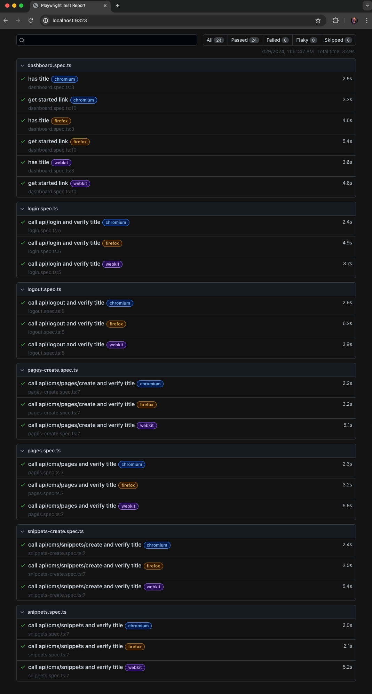
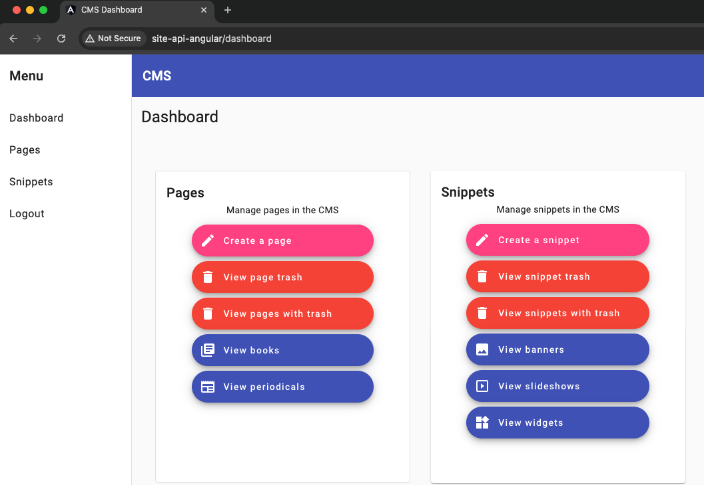

# Site: Playground CMS UI with Angular

[](.github/workflows/ci.yml)

This project was generated with [Angular CLI](https://github.com/angular/angular-cli) version 16.2.0 and Node v20.

```sh
nvm list
```

```
       v16.20.2
       v20.11.1
->     v20.15.1
```

This package was created, with the following command, to lock in v16 of Angular:

```sh
npx -p @angular/cli@16.2.0 ng new site-playground-cms-angular
```

## Development server

Run `ng serve` for a dev server. Navigate to `http://localhost:4200/`. The application will automatically reload if you change any of the source files.

```sh
ng serve
```

## Build

Run `ng build` to build the project. The build artifacts will be stored in the `dist/` directory.

```sh
ng build
```

Also supported:

```sh
npm run watch
```


## Running unit tests

Run `ng test` to execute the unit tests via [Karma](https://karma-runner.github.io).

```sh
ng test
```
Results of test:



Live Karma and Jasmine Test Report:



## Running end-to-end tests

To execute the end-to-end tests via a Playwright, run:

```sh
ng e2e
```

Results of test:



Playwright Report:



See test reports with:

```sh
npm run report
```

## Linting and Formatting

See coding issues:

```sh
ng lint
```

Fix recommended coding issues

```sh
npm run lint:fix
```

Formatting code with prettier

```sh
npm run prettier
```


## Application




## Interfaces

| Interface | Group |
|---------|---------|
| [ResponseShowMeta](src/app/types.ts#L1) | Responses |
| [ResponseIndexMeta](src/app/types.ts#L9) | Responses |
| [ResponseIndexLinks](src/app/types.ts#L16) | Responses |
| [PageEditModel](src/app/types.ts#L23) | Pages |
| [Page](src/app/types.ts#L99) | Pages |
| [Pages](src/app/types.ts#L199) | Pages |
| [PagesResponse](src/app/types.ts#L201) | Pages, Responses |
| [PageResponse](src/app/types.ts#L207) | Pages, Responses |
| [PageRevision](src/app/types.ts#L213) | Pages, Revisions |
| [PageRevisions](src/app/types.ts#L315) | Pages, Revisions |
| [PageRevisionsResponse](src/app/types.ts#L317) | Pages, Responses, Revisions |
| [PageRevisionResponse](src/app/types.ts#L323) | Pages, Responses, Revisions |
| [SnippetEditModel](src/app/types.ts#L328) | Snippets |
| [Snippet](src/app/types.ts#422) | Snippets |
| [Snippets](src/app/types.ts#517) | Snippets |
| [SnippetsResponse](src/app/types.ts#519) | Snippets, Responses |
| [SnippetResponse](src/app/types.ts#525) | Snippets, Responses |
| [SnippetRevision](src/app/types.ts#530) | Snippets, Revisions |
| [SnippetRevisions](src/app/types.ts#626) | Snippets, Revisions |
| [SnippetRevisionsResponse](src/app/types.ts#628) | Snippets, Responses, Revisions |
| [SnippetRevisionResponse](src/app/types.ts#634) | Snippets, Responses, Revisions |
| [User](src/app/types.ts#639) | Users |
| [Users](src/app/types.ts#649) | Users |
| [UsersResponse](src/app/types.ts#651) | Users, Responses |
| [UserResponse](src/app/types.ts#657) | Users, Responses |
