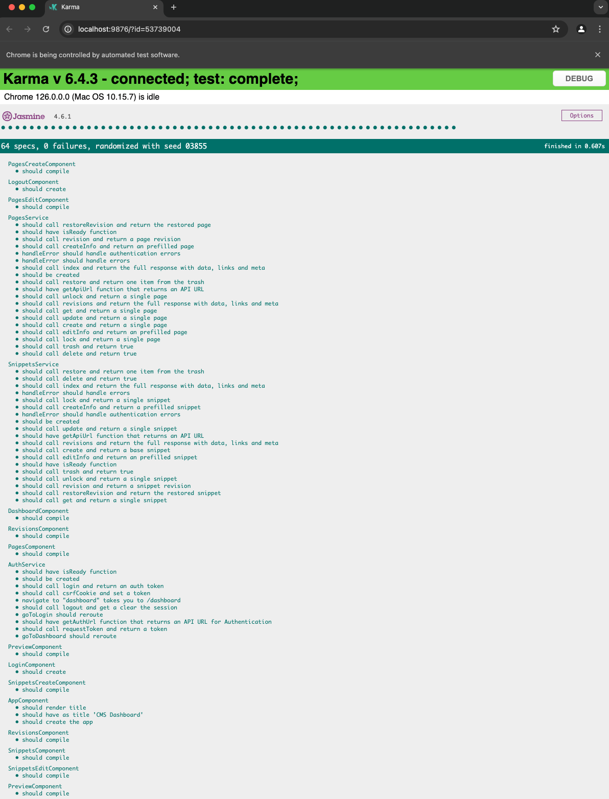

# Site: Playground CMS UI with Angular

[](.github/workflows/ci.yml)


<section>

<details>
<summary>Toggle Package Information</summary>

## Package Information


### Library Versions

This project was generated with [Angular CLI](https://github.com/angular/angular-cli) version 16.2.0 and Node v20.

```sh
nvm list
```

```
       v16.20.2
       v20.11.1
->     v20.15.1
```

This package was created, with the following command, to lock in v16 of Angular:

```sh
npx -p @angular/cli@16.2.0 ng new site-playground-cms-angular
```

</details>

</section>


<section>

<details>
<summary>Toggle Package Development Information</summary>

## Development

### `ng serve`

Run `ng serve` for a dev server. Navigate to `http://localhost:4200/`. The application will automatically reload if you change any of the source files.

```sh
ng serve
```

### `ng build`

Run `ng build` to build the project. The build artifacts will be stored in the `dist/` directory.

```sh
ng build
```

### `npm run watch`

Also supported:

```sh
npm run watch
```


</details>

</section>


<section>

<details open>
<summary>Toggle Testing Information</summary>

## Testing

### Running unit tests

#### `ng test`

Run `ng test` to execute the unit tests via [Karma](https://karma-runner.github.io).

```sh
ng test
```
Results of test:


Live Karma and Jasmine Test Report:



### Running end-to-end tests with Playwright

#### `ng e2e`

To execute the end-to-end tests via a Playwright, run:

```sh
ng e2e
```

Results of test:


### Playwright Reports

#### `npm run report`

See test reports with:

```sh
npm run report
```


### Playwright Reports under GitHub Actions

1. Go to [GitHub Actions for this package](https://github.com/gammamatrix/site-playground-cms-angular/actions)


2. Go into one of the builds to download the Playwright Report.


- The download will be named `playwright-report.zip` and it contains an `index.html` shown above from `npm run report`

</details>

</section>

<section>

<details>
<summary>Toggle Coding Standards Information</summary>

## Coding Standards

Development is done using [VS Code](https://code.visualstudio.com/).

In order to set up [Prettier](https://prettier.io/) and [Linting with angular-eslint](https://github.com/angular-eslint/angular-eslint), these commands were ran before adding components.

Aliases have also been added to scripts section under [package.json](package.json)

```sh
npm install prettier --save-dev
```

```sh
npx prettier --write .
```

```sh
ng add @angular-eslint/schematics
```

```sh
npm install prettier-eslint eslint-config-prettier eslint-plugin-prettier --save-dev
```


## Linting and Formatting

See coding issues:

```sh
ng lint
```

Fix recommended coding issues

```sh
npm run lint:fix
```

Formatting code with prettier

```sh
npm run prettier
```

</details>

</section>

<section>

<details open>
<summary>Toggle Application Information</summary>

## Application

### Dashboard


### Interfaces

| Interface | Group |
|---------|---------|
| [ResponseShowMeta](src/app/types.ts#L1) | Responses |
| [ResponseIndexMeta](src/app/types.ts#L9) | Responses |
| [ResponseIndexLinks](src/app/types.ts#L16) | Responses |
| [PageEditModel](src/app/types.ts#L23) | Pages |
| [Page](src/app/types.ts#L99) | Pages |
| [Pages](src/app/types.ts#L199) | Pages |
| [PagesResponse](src/app/types.ts#L201) | Pages, Responses |
| [PageResponse](src/app/types.ts#L207) | Pages, Responses |
| [PageRevision](src/app/types.ts#L213) | Pages, Revisions |
| [PageRevisions](src/app/types.ts#L315) | Pages, Revisions |
| [PageRevisionsResponse](src/app/types.ts#L317) | Pages, Responses, Revisions |
| [PageRevisionResponse](src/app/types.ts#L323) | Pages, Responses, Revisions |
| [SnippetEditModel](src/app/types.ts#L328) | Snippets |
| [Snippet](src/app/types.ts#L422) | Snippets |
| [Snippets](src/app/types.ts#L517) | Snippets |
| [SnippetsResponse](src/app/types.ts#L519) | Snippets, Responses |
| [SnippetResponse](src/app/types.ts#L525) | Snippets, Responses |
| [SnippetRevision](src/app/types.ts#L530) | Snippets, Revisions |
| [SnippetRevisions](src/app/types.ts#L626) | Snippets, Revisions |
| [SnippetRevisionsResponse](src/app/types.ts#L628) | Snippets, Responses, Revisions |
| [SnippetRevisionResponse](src/app/types.ts#L634) | Snippets, Responses, Revisions |
| [User](src/app/types.ts#L639) | Users |
| [Users](src/app/types.ts#L649) | Users |
| [UsersResponse](src/app/types.ts#L651) | Users, Responses |
| [UserResponse](src/app/types.ts#L657) | Users, Responses |


</details>

</section>

<section>

<details>
<summary>Toggle Continuous Integration Information</summary>

## Continuous Integration

### Slack Integration

The [GitHub CI Workflow: ci.yml](.github/workflows/ci.yml) sends the status and results of the build to Slack:


</details>

</section>

<section>

<details>
<summary>Toggle Enviroment Information</summary>

## Enviroments

### Production

```sh
ng build
```

**NOTE:** Production requires an environment variable `API_CMS_URL` to be defined to access the CMS API.

### Demo

```sh
ng build --configuration=demo
```

### Development

```sh
ng build --configuration=development
```

See: [src/environments/environment.development.ts](src/environments/environment.development.ts)

```ts
export const environment = {
  production: false,
  apiUrl: 'http://site-playground-integration/mock/api',
};
```

</details>

</section>

<details>
<summary>Toggle Package Components</summary>

## Package Components

This package utilizes [@angular/material](https://material.angular.io/)

**NOTE:** These commands were used to build out

### Generating components

```sh
ng generate environments
```

```sh
ng generate @angular/material:navigation components/navigation
```

```sh
ng generate component components/footer
```

```sh
ng generate @angular/material:dashboard components/dashboard
```

```sh
ng generate @angular/material:table components/snippets
```

```sh
ng generate @angular/material:table components/pages
```

</details>

</section>


